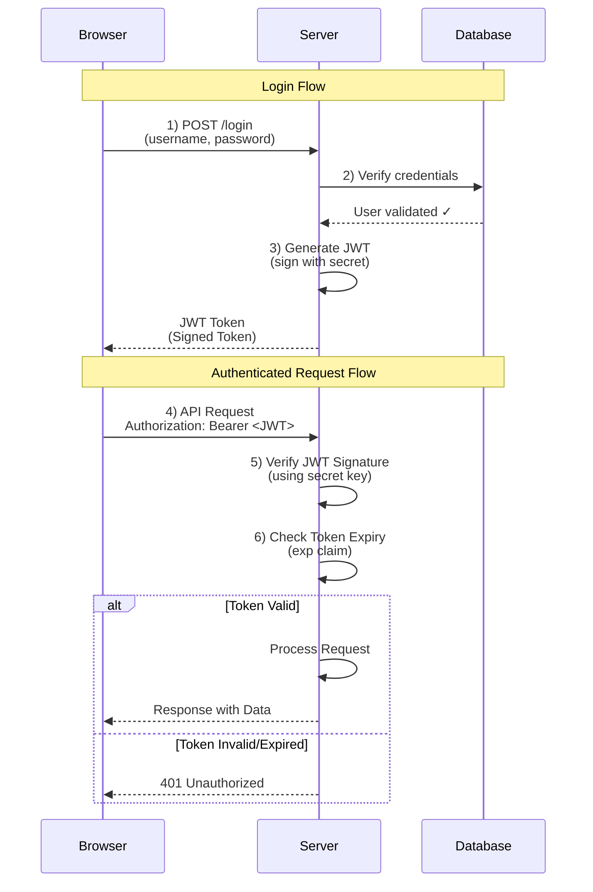
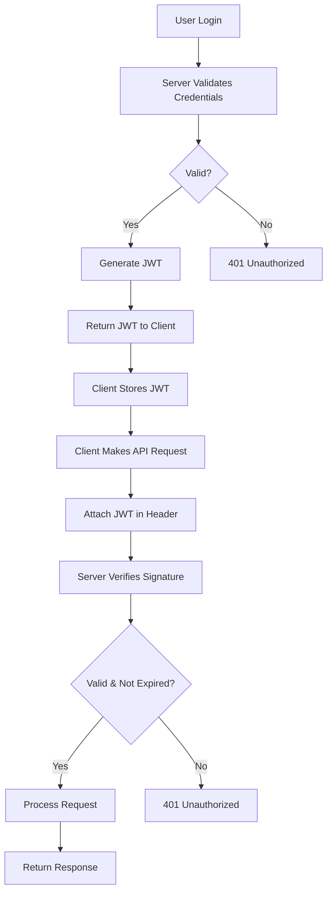

# The Complete Authentication & Authorization Guide for Backend Engineers

> **Master Authentication & Authorization**: From Historical Context to Production Implementation

---

## Table of Contents

- [Part 1: Core Concepts](#part-1-core-concepts)
- [Part 2: Historical Evolution](#part-2-historical-evolution)
- [Part 3: Essential Components](#part-3-essential-components)
- [Part 4: Authentication Types](#part-4-authentication-types)
- [Part 5: Authorization](#part-5-authorization)
- [Part 6: Security Best Practices](#part-6-security-best-practices)
- [Part 7: Implementation Guides](#part-7-implementation-guides)
- [Part 8: Quick Reference](#part-8-quick-reference)

---

# Part 1: Core Concepts

## What Are Authentication and Authorization?

### Authentication: "Who Are You?"
**Definition**: The process of verifying a user's identity - confirming that users are who they claim to be.

**Real-World Analogy**: When you show your driver's license at airport security, you're authenticating yourself. The security officer verifies that you are the person shown on the ID.

**Technical Example**:
```
User enters: email@example.com + password123
Server checks: Does this match our records?
Result: Yes → User authenticated
        No → Access denied
```

### Authorization: "What Can You Do?"
**Definition**: The process of determining what permissions and capabilities an authenticated user has in a system.

**Real-World Analogy**: After passing airport security (authentication), your boarding pass determines which gate you can access, which seat you can occupy (authorization). Your ticket doesn't grant access to the pilot's cockpit or first class if you have an economy ticket.

**Technical Example**:
```
Authenticated user tries to delete file
System checks: Does this user have 'delete' permission?
Result: Admin role → Yes, proceed
        Regular user → No, forbidden
```

### The Workflow
```
1. Authentication (Verify Identity)
         ↓
2. Authorization (Check Permissions)
         ↓
3. Access Granted/Denied
```

**Why Both Matter**:
- **Authentication alone** tells you WHO someone is
- **Authorization** tells you WHAT they can do
- You need BOTH for proper security

**Example Scenario**:
```
Email app:
  Authentication: Prove you're john@example.com (password/biometric)
  Authorization: 
    ✓ Can read your own emails
    ✓ Can send emails as yourself
    ✗ Cannot read other users' emails
    ✗ Cannot access admin panel (unless admin)
```

---

# Part 2: Historical Evolution

## Why History Matters
Understanding how authentication evolved helps you:
- Appreciate modern solutions
- Understand trade-offs
- Avoid repeating past mistakes
- Choose appropriate methods

## Timeline of Authentication

### Pre-Industrial Era: Trust-Based Authentication

**How It Worked**:
- Village elders vouched for people
- Deals sealed with handshakes
- Identity = community recognition

**Real-World Analogy**: Small town where everyone knows each other. "That's John's son" is enough identification.

**The Problem**: Didn't scale beyond small communities.

```
┌──────────────────────────────┐
│  Village Elder says:         │
│  "I vouch for this person"   │
│  ↓                            │
│  Deal accepted               │
└──────────────────────────────┘

Works in small village
Fails in large city or between regions
```

### Medieval Period: Wax Seals (First Tokens)

**Innovation**: Physical tokens that prove identity

**How It Worked**:
```
1. Authority creates unique seal pattern
2. Seals pressed on documents
3. Recipients verify seal authenticity
4. Seal = authentication token
```

**Real-World Analogy**: Like a physical password. Just as you have a unique house key, nobles had unique seal patterns. A letter with the king's seal proved it was genuinely from the king.

**Security Principle**: "Something You Have"

**Vulnerabilities**:
- Could be forged (bypass attacks)
- Led to watermarks and encrypted codes

**Modern Parallel**: Physical security tokens, smart cards, YubiKeys

### Industrial Revolution: Passphrases

**Context**: Telegraph became critical infrastructure

**Innovation**: Pre-agreed passphrases (shared secrets)

```
Telegraph Operator A: "The eagle flies at midnight"
Telegraph Operator B: Validates phrase → Message trusted
```

**Security Principle Shift**: From "Something You Have" to **"Something You Know"**

**Characteristics**:
- Static passwords (same phrase repeatedly)
- Verbally or written communication
- Stored in memory

**The Risk**: If intercepted once, compromised forever

**Modern Parallel**: Passwords (but we rotate them now!)

### 1961: Digital Passwords

**Breakthrough**: MIT's CTSS (Compatible Time-Sharing Systems)

**Problem Solved**: Multiple users on one computer without data sharing

```
Before:
┌────────────────┐
│  Computer      │
│  All files     │
│  visible to    │
│  everyone      │
└────────────────┘

After (with passwords):
┌────────────────┐
│  Computer      │
│  User A → Password → Only A's files
│  User B → Password → Only B's files
│  User C → Password → Only C's files
└────────────────┘
```

**Critical Mistake**: Stored passwords in **plain text**

**The Incident**: Someone printed the password file

**The Lesson**: "Passwords should NEVER be stored in plain text"

**This principle is STILL critical in 2025!**

#### The Solution: Hashing

**What is Hashing?**
One-way cryptographic function that transforms text into irreversible fixed-length string.

```python
import hashlib

# Input: "myPassword123"
password = "myPassword123"
hash_obj = hashlib.sha256(password.encode())
# Output: "ef92b778bce853e59f8c..."

# Input: "password"
password2 = "password"
hash_obj2 = hashlib.sha256(password2.encode())
# Output: "5e884898da28047151d0..."

# Input: "myPassword123" (same as first)
password3 = "myPassword123"
hash_obj3 = hashlib.sha256(password3.encode())
# Output: "ef92b778bce853e59f8c..." (same hash!)
```

**Key Properties**:
1. **Deterministic**: Same input → same output
2. **Fixed length**: Any input → same length output
3. **One-way**: Cannot reverse hash → original password
4. **Collision resistant**: Different inputs → different outputs

**How It Works**:
```python
import hashlib

# Registration
password = "myPassword123"
hashed = hashlib.sha256(password.encode()).hexdigest()
# Server stores: "ef92b778bce..." (only hash, not password)

# Login
password_attempt = "myPassword123"
hashed_attempt = hashlib.sha256(password_attempt.encode()).hexdigest()
# Server compares: stored_hash == new_hash
# Match → Authenticated!
```

**Why Secure**: Even if database stolen, attackers only get hashes (can't reverse)

**Modern Enhancement - Salting**:
```python
import hashlib
import secrets

password = "myPassword123"
salt = secrets.token_hex(8)  # "x9k2m5p8" (random per user)
combined = password + salt
hashed = hashlib.sha256(combined.encode()).hexdigest()  # "9f7j4k2p..." (stored with salt)

# Same password, different users → different hashes!
```

### 1970s: Asymmetric Cryptography Revolution

**Pioneers**: Whitfield Diffie, Martin Hellman

**The Problem**: How to share encryption keys securely?

```
Symmetric Encryption Problem:
  Alice wants to send Bob encrypted message
  Challenge: How does Alice share the key with Bob?
  If key sent over network → Attacker intercepts → Game over
```

**The Solution**: **Two different keys**
- Public key: Shared openly, encrypts
- Private key: Secret, decrypts

```
┌────────────────────────────────┐
│  ASYMMETRIC CRYPTOGRAPHY       │
│                                │
│  Alice                  Bob    │
│    │                     │     │
│    │ Bob's Public Key    │     │
│    │◄────────────────────┤     │
│    │                     │     │
│    │ Encrypts with       │     │
│    │ Bob's Public Key    │     │
│    │                     │     │
│    │ Encrypted Message   │     │
│    ├─────────────────────►│     │
│    │                     │     │
│    │         Decrypts with     │
│    │         Bob's Private Key │
│    │         (never shared)    │
└────────────────────────────────┘
```

**Real-World Analogy**: Mailbox with a slot. Anyone (public key) can drop mail in, but only the person with the mailbox key (private key) can read it.

**Impact**: Backbone of modern authentication
- HTTPS/TLS
- SSH
- Digital signatures
- PKI (Public Key Infrastructure)

### 1990s: Multi-Factor Authentication (MFA)

**The Problem**: Passwords alone insufficient
- Brute force attacks
- Dictionary attacks
- Leaked password databases

**The Solution**: Combine multiple independent factors

```
┌─────────────────────────────────┐
│  THREE AUTHENTICATION FACTORS   │
│                                 │
│  1. Something You KNOW          │
│     → Passwords, PINs           │
│                                 │
│  2. Something You HAVE          │
│     → Phone, Token, Smart Card  │
│                                 │
│  3. Something You ARE           │
│     → Fingerprint, Face, Retina │
└─────────────────────────────────┘
```

**Real-World Analogy**: Bank vault access
1. PIN code (something you know)
2. Key card (something you have)
3. Fingerprint (something you are)

**Example - OTP (One-Time Password)**:
```
Login with password ✓
  ↓
System sends code to phone: "123456"
  ↓
User enters code
  ↓
Code matches + not expired → Access granted
```

**Why MFA Matters**: Even if password stolen, attacker still needs physical device/biometric

#### Biometric Authentication

**How It Works**:
```
1. Enrollment
   Capture fingerprint → Create mathematical template → Store securely

2. Authentication  
   Capture fingerprint → Create template → Compare with stored
   Match % > threshold (e.g., 95%) → Authenticate
```

**Challenges**:
- **False Positives**: Wrong person accepted (twin accessing sibling's phone)
- **False Negatives**: Right person rejected (injured finger)
- **Can't Change**: Stolen biometric data = permanent compromise

### 21st Century: Modern Authentication

**New Challenges**:
- Billions of users globally
- Mobile devices
- Microservices
- API-based architectures

**Modern Solutions**:

**1. OAuth 2.0**: Delegated authorization (Sign in with Google/Facebook)

**2. JWT (JSON Web Tokens)**: Stateless authentication for distributed systems

**3. Zero Trust**: "Never trust, always verify"

**4. Passwordless**:
- WebAuthn (hardware security keys)
- Magic links (email-based)
- Biometric authentication

**Example - WebAuthn**:
```
1. User clicks "Sign in with security key"
2. Inserts USB key or uses built-in biometric
3. Authenticates with PIN/biometric
4. Key signs challenge with private key
5. Server verifies with public key
6. Authenticated - no password needed!
```

### The Future

**1. Decentralized Identity (Blockchain)**
You own your identity, not companies

```
Traditional:
  Google owns your identity → grants access to websites

Decentralized:
  You own identity on blockchain → prove to any website
```

**2. Behavioral Biometrics**
Continuous authentication via behavior patterns
- Typing speed/rhythm
- Mouse movements
- Device interaction patterns

**3. Post-Quantum Cryptography**
Current encryption vulnerable to quantum computers

```
Current:
  Classical computer: Millions of years to break RSA
  Quantum computer: Hours to break RSA

Solution: Post-quantum algorithms (NIST standardizing now)
```

---

# Part 3: Essential Components

## The Three Pillars: Sessions, JWTs, and Cookies

These three components appear in virtually all authentication workflows.

### 1. Sessions: Server-Side Memory

#### The Problem HTTP Solves

**HTTP is Stateless**:
```
Request 1: GET /products
Server: Here are products
[Server forgets you exist]

Request 2: GET /cart
Server: Who are you? Don't remember you
```

**Real-World Analogy**: Coffee shop barista with amnesia. Every visit is like the first time.

**Why This Was a Problem**:
- Shopping carts need to remember items
- Users need to stay logged in
- Preferences need persistence

#### How Sessions Work

**Phase 1: Session Creation**
```
User logs in
  ↓
Server generates unique ID: "sess_a7k9m2x4p8"
  ↓
Server stores in Redis/DB:
  ┌─────────────────┐
  │ ID: sess_a7k9...│
  │ user_id: 12345  │
  │ role: "admin"   │
  │ cart: [...]     │
  │ expires: ...    │
  └─────────────────┘
  ↓
Sends ID to browser (as cookie)
```

**Phase 2: Using Session**
```
Every request:
  Browser sends session ID automatically
  ↓
  Server looks up in Redis
  ↓
  Retrieves user data
  ↓
  Processes request with full context
```

**Phase 3: Expiration**
```
After 15 minutes inactive:
  Server deletes from Redis
  User must login again
```

#### Storage Evolution

**1. File-Based (Early)**
```
/tmp/sessions/sess_abc123
Problem: Slow, doesn't scale
```

**2. Database-Backed**
```sql
CREATE TABLE sessions (
  session_id VARCHAR PRIMARY KEY,
  user_id INT,
  data JSON,
  expires_at TIMESTAMP
);
Problem: Still disk I/O, bottleneck
```

**3. In-Memory (Modern - Redis)**
```
Redis (RAM):
  Key: sess_abc123
  Value: {user_id: 123, role: "admin", ...}
  TTL: 900 seconds

Access time: <1ms (vs 10-100ms for DB)
```

**Why Redis**:
- Blazing fast (RAM-based)
- Built-in expiration (TTL)
- Atomic operations
- Can persist to disk

**Performance**:
```
File System: 10-100ms/read
Database:    5-50ms/read
Redis:       <1ms/read

For 1000 req/sec:
  Files: 10-100 sec CPU time
  DB:    5-50 sec CPU time
  Redis: <1 sec CPU time
```

### 2. JWTs: Self-Contained Tokens

#### The Problem Sessions Couldn't Solve

**1. Memory Overhead**
```
1M users × 5KB/session = 5GB RAM
10M users = 50GB RAM
100M users = 500GB RAM
```

**2. Distribution Nightmare**
```
User logs in → Server 1 (US-East) creates session
Next request → Load balancer → Server 2 (US-West)
Server 2: "Don't have your session!"

Solution: Replicate sessions → Latency, complexity
```

**Real-World Analogy**: Hotel key that only works at check-in location. To work everywhere, hotels must constantly sync - slow and error-prone.

#### JWT Structure

```
eyJhbGc...  .  eyJzdWI...  .  SflKxw...
   ↑              ↑              ↑
 HEADER        PAYLOAD       SIGNATURE
```

**Decoded**:

**Header** (Algorithm metadata):
```json
{
  "alg": "HS256",
  "typ": "JWT"
}
```

**Payload** (User data):
```json
{
  "sub": "12345",           // User ID
  "email": "john@ex.com",
  "role": "admin",
  "iat": 1706356800,        // Issued at
  "exp": 1706360400         // Expires
}
```

**Signature** (Verification):
```
HMACSHA256(
  base64(header) + "." + base64(payload),
  "my-secret-key"
)
```

**Real-World Analogy**: Signed diploma. The diploma (payload) contains your info. The university's seal (signature) proves authenticity. Anyone can read it, but only the university could create that specific seal.

#### JWT Workflow

```python
from datetime import datetime, timedelta
import jwt
from fastapi import FastAPI, HTTPException, Depends
from fastapi.security import HTTPBearer, HTTPAuthorizationCredentials

app = FastAPI()
security = HTTPBearer()
SECRET_KEY = "your-secret-key"

# LOGIN
@app.post("/login")
async def login(credentials: dict):
    # Server validates credentials
    user = await validate_user(credentials)
    
    # Server creates JWT
    payload = {
        "sub": str(user.id),
        "role": user.role,
        "exp": datetime.utcnow() + timedelta(hours=1)
    }
    token = jwt.encode(payload, SECRET_KEY, algorithm="HS256")
    
    return {"token": token}

# AUTHENTICATED REQUEST
async def verify_token(credentials: HTTPAuthorizationCredentials = Depends(security)):
    try:
        # Server extracts and verifies token
        token = credentials.credentials
        decoded = jwt.decode(token, SECRET_KEY, algorithms=["HS256"])
        # If valid: decoded = {"sub": "123", "role": "admin"}
        return decoded
    except jwt.PyJWTError:
        raise HTTPException(status_code=401, detail="Invalid token")

@app.get("/api/profile")
async def get_profile(user: dict = Depends(verify_token)):
    # Process request (NO database lookup!)
    return {"user_id": user["sub"], "role": user["role"]}
```

## JWT Authentication Flow Diagram



### Step-by-Step Breakdown

**Login Phase:**
1. **Browser → Server**: User submits credentials
2. **Server → Database**: Validates username/password
3. **Server**: Creates signed JWT with user claims
4. **Server → Browser**: Returns JWT token

**Authenticated Request Phase:**
1. **Browser → Server**: Sends request with JWT in Authorization header
2. **Server**: Verifies JWT signature using secret key
3. **Server**: Checks if token is expired
4. **Server → Browser**: Returns protected data if valid, 401 if invalid

### Alternative: Simple Flow Diagram




                                    

#### Advantages

**1. Stateless = Scalable**
```
Request → Any server → Verifies JWT → Responds
No Redis needed
No session sync
Add servers instantly
```

**2. Microservices Friendly**
```
Gateway verifies JWT once
Passes to all services
Each service can verify independently
```

**3. Cross-Domain**
```
example.com
api.example.com
mobile-api.example.com
All accept same JWT!
```

#### Disadvantages

**1. Cannot Revoke**
```
Problem: User account compromised

Session: Delete from Redis → Instant lockout ✓
JWT: Token valid until expiration ✗
    Must wait hours!
```

**Solutions**:
```python
from datetime import timedelta

# Option 1: Short expiration + Refresh tokens
access_token_expires = timedelta(minutes=15)
refresh_token_expires = timedelta(days=7)
# refresh_token: stored server-side, can revoke

# Option 2: Blacklist
REVOKED_JWTS = set()
if token_jti in REVOKED_JWTS:
    raise HTTPException(status_code=401, detail="Token revoked")
# But this defeats "stateless"!

# Option 3: Change secret (nuclear option)
# Change SECRET_KEY → All users logged out globally
```

**2. Token Size**
```
Session ID: ~20 bytes
JWT:        ~200-500 bytes

Sent with EVERY request
1000 req/sec × 500 bytes = 500KB/sec = 43GB/day overhead
```

**3. Cannot Update**
```
User promoted admin → manager

Session: Update Redis → immediate effect
JWT: Token says "manager", must wait for expiration
```

### 3. Cookies: Automatic Token Transport

#### The Problem Cookies Solve

Without cookies:
```javascript
// Manual token management
fetch('/api/profile', {
  headers: {
    'X-Session-ID': 'sess_abc'  // Must remember every time!
  }
});
```

**Problems**: Easy to forget, repetitive, vulnerable

#### How Cookies Work

**Server Sets Cookie**:
```http
Set-Cookie: session_id=sess_abc; HttpOnly; Secure; SameSite=Strict
```

**Browser Automatically Sends**:
```http
GET /api/profile
Cookie: session_id=sess_abc
```

**Real-World Analogy**: Loyalty card. Shop gives you card (server sets cookie), you keep it (browser stores), you automatically show it every visit (browser sends automatically).

#### Cookie Attributes (Critical for Security)

**1. HttpOnly**
```
Set-Cookie: token=abc; HttpOnly

JavaScript CANNOT access cookie
Prevents XSS attacks:
  Malicious script tries: document.cookie
  Returns: "" (empty - cookie hidden)
```

**2. Secure**
```
Set-Cookie: token=abc; Secure

Cookie ONLY sent over HTTPS
Prevents man-in-the-middle attacks:
  HTTP: Cookie NOT sent
  HTTPS: Cookie sent
```

**3. SameSite**
```
Strict: Only same-site requests
Lax: Safe cross-site (GET links)
None: All requests (needs Secure)

Prevents CSRF attacks:
  Attacker site tries to use your cookie
  Browser: "Nope, different site"
```

**4. Max-Age**
```
Max-Age=3600     // 1 hour
Max-Age=86400    // 24 hours
Max-Age=604800   // 7 days
```

**Security Checklist**:
```
✓ Always HttpOnly for auth cookies
✓ Always Secure in production
✓ Use SameSite=Strict or Lax
✓ Set appropriate Max-Age
✓ Use HTTPS
```

---

# Part 4: Authentication Types

## 1. Stateful Authentication

### Complete Workflow

```
CLIENT                          SERVER
  │
  │  POST /login
  │  {email, password}
  ├──────────────────────────────►
  │                               │ Validate credentials
  │                               │ Generate session_id
  │                               │ Store in Redis:
  │                               │   sess_x7k2: {
  │                               │     user_id: 123,
  │                               │     role: "admin"
  │                               │   }
  │  Set-Cookie: session_id
  │◄──────────────────────────────┤
  │
  │  GET /api/profile
  │  Cookie: session_id=sess_x7k2
  ├──────────────────────────────►
  │                               │ Redis.get(sess_x7k2)
  │                               │ → user_id: 123
  │                               │ → role: "admin"
  │  {user: {...}}
  │◄──────────────────────────────┤
```

### Pros

✓ **Centralized Control**: View/revoke all sessions
✓ **Immediate Revocation**: Delete from Redis = instant lockout
✓ **Dynamic Updates**: Change role in Redis = immediate effect
✓ **Rich Session Data**: Store complex objects
✓ **Better Security**: Session ID is meaningless random string

### Cons

✗ **Scalability**: Need shared Redis for multiple servers
✗ **Memory Cost**: 1M users × 5KB = 5GB RAM
✗ **Latency**: Extra Redis lookup every request
✗ **Single Point of Failure**: Redis down = all users logged out

### Implementation Example

```python
from fastapi import FastAPI, HTTPException, Depends, Response, Cookie
from fastapi.responses import JSONResponse
import redis.asyncio as redis
import secrets
import json
from datetime import datetime
from typing import Optional

app = FastAPI()
redis_client = redis.Redis(host='localhost', port=6379, decode_responses=True)

# LOGIN
@app.post('/api/login')
async def login(credentials: dict, response: Response):
    user = await validate_user(credentials)
    
    # Generate session ID
    session_id = secrets.token_hex(32)
    
    # Store in Redis
    session_data = json.dumps({
        "user_id": user.id,
        "role": user.role,
        "created_at": datetime.utcnow().isoformat()
    })
    await redis_client.setex(
        f"sess:{session_id}",
        3600,  # 1 hour TTL
        session_data
    )
    
    # Set cookie
    response.set_cookie(
        key="session_id",
        value=session_id,
        httponly=True,
        secure=True,
        samesite="strict",
        max_age=3600
    )
    
    return {"message": "Logged in"}

# AUTH DEPENDENCY
async def require_auth(session_id: Optional[str] = Cookie(None)):
    if not session_id:
        raise HTTPException(status_code=401, detail="Not authenticated")
    
    data = await redis_client.get(f"sess:{session_id}")
    
    if not data:
        raise HTTPException(status_code=401, detail="Session expired")
    
    user = json.loads(data)
    
    # Extend session
    await redis_client.expire(f"sess:{session_id}", 3600)
    
    return user

# PROTECTED ROUTE
@app.get('/api/profile')
async def get_profile(user: dict = Depends(require_auth)):
    return {
        "user_id": user["user_id"],
        "role": user["role"]
    }

# LOGOUT
@app.post('/api/logout')
async def logout(
    response: Response,
    session_id: Optional[str] = Cookie(None),
    user: dict = Depends(require_auth)
):
    await redis_client.delete(f"sess:{session_id}")
    response.delete_cookie("session_id")
    return {"message": "Logged out"}
```

## 2. Stateless Authentication (JWT)

### Complete Workflow

```
CLIENT                          SERVER
  │
  │  POST /login
  │  {email, password}
  ├──────────────────────────────►
  │                               │ Validate credentials
  │                               │ Create JWT:
  │                               │   payload: {
  │                               │     sub: "123",
  │                               │     role: "admin",
  │                               │     exp: 1706360400
  │                               │   }
  │                               │ Sign with SECRET_KEY
  │  {token: "eyJhbGc..."}
  │◄──────────────────────────────┤
  │
  │  GET /api/profile
  │  Authorization: Bearer eyJhbGc...
  ├──────────────────────────────►
  │                               │ jwt.verify(token, SECRET)
  │                               │ → {sub: "123", role: "admin"}
  │                               │ (NO database lookup!)
  │  {user: {...}}
  │◄──────────────────────────────┤
```

### Pros

✓ **Stateless**: No server storage needed
✓ **Scalable**: Works across distributed servers
✓ **Fast**: No database lookup (CPU-only verification)
✓ **Microservices**: Each service verifies independently
✓ **Cross-domain**: Works everywhere

### Cons

✗ **Cannot Revoke**: Token valid until expiration
✗ **Token Size**: 200-500 bytes vs 20 bytes for session ID
✗ **Cannot Update**: User info locked until expiration
✗ **Security Concerns**: Must be stored carefully

### Implementation Example

```python
from fastapi import FastAPI, HTTPException, Depends
from fastapi.security import HTTPBearer, HTTPAuthorizationCredentials
import jwt
from datetime import datetime, timedelta
import os

app = FastAPI()
security = HTTPBearer()
SECRET_KEY = os.getenv("JWT_SECRET")

// LOGIN
app.post('/api/login', async (req, res) => {
  const user = await validateUser(req.body);
  
  // Create JWT
  const token = jwt.sign(
    {
      sub: user.id.toString(),
      email: user.email,
      role: user.role,
      exp: Math.floor(Date.now() / 1000) + 3600  // 1 hour
    },
    SECRET_KEY,
    {algorithm: 'HS256'}
  );
  
  res.json({
    token: token,
    expires_in: 3600
  });
});

// AUTH MIDDLEWARE
const verifyToken = (req, res, next) => {
  const authHeader = req.headers.authorization;
  
  if (!authHeader || !authHeader.startsWith('Bearer ')) {
    return res.status(401).json({error: "No token"});
  }
  
  const token = authHeader.split(' ')[1];
  
  try {
    const decoded = jwt.verify(token, SECRET_KEY);
    req.user = decoded;
    next();
  } catch (err) {
    if (err.name === 'TokenExpiredError') {
      return res.status(401).json({error: "Token expired"});
    }
    return res.status(401).json({error: "Invalid token"});
  }
};

// PROTECTED ROUTE
app.get('/api/profile', verifyToken, (req, res) => {
  res.json({
    user_id: req.user.sub,
    email: req.user.email,
    role: req.user.role
  });
});

// REFRESH TOKEN PATTERN
app.post('/api/refresh', async (req, res) => {
  const {refresh_token} = req.body;
  
  // Verify refresh token (stored server-side)
  const refreshData = await db.refreshTokens.findOne({
    token: refresh_token,
    expires_at: {$gt: new Date()}
  });
  
  if (!refreshData) {
    return res.status(401).json({error: "Invalid refresh token"});
  }
  
  // Issue new access token
  const accessToken = jwt.sign(
    {sub: refreshData.user_id, role: refreshData.role},
    SECRET_KEY,
    {expiresIn: '15m'}
  );
  
  res.json({access_token: accessToken});
});
```

## 3. API Key Authentication

### The Use Case

**Problem**: You want programmatic access to your server without UI/login flow

**Solution**: API keys - long-lived tokens for machine-to-machine communication

### Real-World Example: ChatGPT API

```
UI Access (Human):
  User → Chat Interface → Types message → Gets response
  
API Access (Machine):
  Your Server → HTTP Request + API Key → ChatGPT Server → Response
  
Why? Your app wants ChatGPT features without the UI
```

### How API Keys Work

```
1. User generates key in dashboard
   → Server creates: "sk_live_abc123def456..."
   
2. User stores key securely
   → Environment variable or secret manager
   
3. Use key in requests
   → Header: Authorization: Bearer sk_live_abc...
   
4. Server validates
   → Look up key in database
   → Check permissions, quotas, expiration
   → Process request
```

### Characteristics

- **Long-lived**: Days, months, or years
- **Revocable**: Can delete from database
- **Permission-scoped**: Read-only, read-write, etc.
- **Rate-limited**: Enforce quotas per key

### Implementation Example

```python
from fastapi import FastAPI, HTTPException, Depends
from fastapi.security import HTTPBearer, HTTPAuthorizationCredentials
import hashlib
import secrets
from datetime import datetime
from typing import Optional

app = FastAPI()
security = HTTPBearer()

# GENERATE API KEY
@app.post('/api/keys')
async def generate_api_key(user: dict = Depends(require_auth)):
    api_key = f"sk_{secrets.token_hex(32)}"
    
    hashed_key = hashlib.sha256(api_key.encode()).hexdigest()
    
    await db.api_keys.insert_one({
        "key_hash": hashed_key,
        "user_id": user["id"],
        "permissions": ["read", "write"],
        "created_at": datetime.utcnow(),
        "last_used": None
    })
    
    # Show once, then only show hash
    return {
        "api_key": api_key,
        "message": "Save this key - you won't see it again!"
    }

# VALIDATE API KEY
async def validate_api_key(credentials: HTTPAuthorizationCredentials = Depends(security)):
    api_key = credentials.credentials
    
    if not api_key:
        raise HTTPException(status_code=401, detail="API key required")
    
    hashed_key = hashlib.sha256(api_key.encode()).hexdigest()
    
    key_data = await db.api_keys.find_one({"key_hash": hashed_key})
    
    if not key_data:
        raise HTTPException(status_code=401, detail="Invalid API key")
    
    # Update last used
    await db.api_keys.update_one(
        {"_id": key_data["_id"]},
        {"$set": {"last_used": datetime.utcnow()}}
    )
    
    return key_data

# PROTECTED API ENDPOINT
@app.get('/api/data')
async def get_data(api_key: dict = Depends(validate_api_key)):
    if "read" not in api_key["permissions"]:
        raise HTTPException(status_code=403, detail="Permission denied")
    
    data = await fetch_data(api_key["user_id"])
    return data
```

### Best Practices

```
✓ Hash keys before storing (like passwords)
✓ Show key only once at creation
✓ Support key rotation
✓ Implement rate limiting
✓ Log all API key usage
✓ Allow users to revoke keys
✓ Set expiration dates
✓ Use different keys for dev/prod
```

## 4. OAuth 2.0 & OpenID Connect

### The Delegation Problem

**Scenario**: Travel app needs to scan your Gmail for flight tickets

**Bad Solution** (Before OAuth):
```
Travel App: "Give us your Gmail password"
User: Provides password
Travel App: Full access to email, contacts, everything!

Problems:
  ✗ Share password = give complete access
  ✗ Can't revoke without changing password everywhere
  ✗ No permission scoping
  ✗ Huge security risk
```

**Good Solution** (OAuth 2.0):
```
Travel App: "We need read-only access to your email"
User: Redirected to Google → Approves specific permission
Travel App: Gets limited token (read-only, emails only)

Benefits:
  ✓ No password sharing
  ✓ Scoped permissions (read-only)
  ✓ Revokable anytime
  ✓ Time-limited
```

### OAuth 2.0 Components

```
┌──────────────────────────────────────────┐
│  OAUTH 2.0 ACTORS                        │
├──────────────────────────────────────────┤
│                                          │
│  1. RESOURCE OWNER (User)                │
│     → You, who owns the data             │
│                                          │
│  2. CLIENT (App requesting access)       │
│     → Travel app                         │
│                                          │
│  3. RESOURCE SERVER (API with data)      │
│     → Gmail servers                      │
│                                          │
│  4. AUTHORIZATION SERVER (Issues tokens) │
│     → Google's auth servers              │
│                                          │
└──────────────────────────────────────────┘
```

### OAuth 2.0 Flow (Authorization Code)

```
1. CLIENT redirects USER to AUTHORIZATION SERVER
   → "TravelApp wants to read your emails"
   
2. USER authenticates and grants permission
   → Logs in to Google, clicks "Allow"
   
3. AUTHORIZATION SERVER sends code to CLIENT
   → Redirect: travelapp.com/callback?code=xyz123
   
4. CLIENT exchanges code for access token
   → POST to Google with code
   → Receives: {access_token: "abc...", refresh_token: "def..."}
   
5. CLIENT uses access_token to access RESOURCE SERVER
   → GET https://gmail.googleapis.com/emails
   → Header: Authorization: Bearer abc...
   
6. RESOURCE SERVER validates token and returns data
   → Google verifies token
   → Returns emails
```

### OAuth 2.0 Grant Types

**1. Authorization Code** (Most secure, for web apps)
```
User-facing apps with server backend
Supports refresh tokens
Most common flow
```

**2. Implicit** (Deprecated, was for SPAs)
```
Tokens in URL (insecure)
No longer recommended
Use Authorization Code + PKCE instead
```

**3. Client Credentials** (Machine-to-machine)
```
Server-to-server
No user involvement
App authenticates as itself
```

**4. Device Code** (Limited input devices)
```
Smart TVs, IoT devices
Shows code on screen
User enters code on phone/computer
```

### OpenID Connect: Adding Identity

**OAuth 2.0**: Authorization only ("what can you access?")
**OpenID Connect**: Authorization + Authentication ("who are you?")

**What OpenID Connect Adds**:
```
OAuth 2.0 returns:
  {access_token: "abc123"}
  
OpenID Connect returns:
  {
    access_token: "abc123",
    id_token: "eyJhbGc..."  // JWT with user identity!
  }
```

**ID Token** (JWT):
```json
{
  "sub": "google|123456",
  "email": "john@example.com",
  "name": "John Doe",
  "picture": "https://...",
  "iss": "https://accounts.google.com",
  "aud": "your-app-id",
  "iat": 1706356800,
  "exp": 1706360400
}
```

### "Sign in with Google" Flow

```
1. User clicks "Sign in with Google"
   
2. Redirected to Google
   → https://accounts.google.com/oauth?
     client_id=your-app&
     redirect_uri=yourapp.com/callback&
     scope=openid email profile
     
3. User logs in to Google, approves
   
4. Google redirects back with code
   → yourapp.com/callback?code=xyz123
   
5. Your server exchanges code for tokens
   → POST to Google
   → Receives: {access_token, id_token}
   
6. Decode id_token to get user info
   → {email, name, picture}
   
7. Create user in your database (if new)
   → Or find existing user
   
8. Create your own session/JWT
   → User now logged into your app!
```

### Implementation Example

```python
from fastapi import FastAPI, HTTPException, Response
from fastapi.responses import RedirectResponse
import httpx
import jwt
import os
from datetime import datetime

app = FastAPI()

GOOGLE_CONFIG = {
    "client_id": os.getenv("GOOGLE_CLIENT_ID"),
    "client_secret": os.getenv("GOOGLE_CLIENT_SECRET"),
    "redirect_uri": "http://localhost:8000/auth/google/callback",
    "auth_url": "https://accounts.google.com/o/oauth2/v2/auth",
    "token_url": "https://oauth2.googleapis.com/token"
}

# INITIATE LOGIN
@app.get('/auth/google')
async def auth_google():
    auth_url = (
        f"{GOOGLE_CONFIG['auth_url']}?"
        f"client_id={GOOGLE_CONFIG['client_id']}&"
        f"redirect_uri={GOOGLE_CONFIG['redirect_uri']}&"
        f"response_type=code&"
        f"scope=openid email profile"
    )
    return RedirectResponse(url=auth_url)

# CALLBACK
@app.get('/auth/google/callback')
async def auth_google_callback(code: str, response: Response):
    try:
        # Exchange code for tokens
        async with httpx.AsyncClient() as client:
            token_response = await client.post(
                GOOGLE_CONFIG["token_url"],
                data={
                    "code": code,
                    "client_id": GOOGLE_CONFIG["client_id"],
                    "client_secret": GOOGLE_CONFIG["client_secret"],
                    "redirect_uri": GOOGLE_CONFIG["redirect_uri"],
                    "grant_type": "authorization_code"
                }
            )
        
        tokens = token_response.json()
        access_token = tokens["access_token"]
        id_token = tokens["id_token"]
        
        # Decode ID token (or verify with Google)
        user_info = jwt.decode(id_token, options={"verify_signature": False})
        
        # Find or create user
        user = await db.users.find_one({"google_id": user_info["sub"]})
        
        if not user:
            user = await db.users.insert_one({
                "google_id": user_info["sub"],
                "email": user_info["email"],
                "name": user_info["name"],
                "picture": user_info["picture"],
                "created_at": datetime.utcnow()
            })
        
        # Create your own session/JWT
        session_id = await create_session(user)
        
        response.set_cookie(
            key="session_id",
            value=session_id,
            httponly=True,
            secure=True,
            samesite="strict"
        )
        
        return RedirectResponse(url='/dashboard')
        
    except Exception as err:
        print(f"OAuth error: {err}")
        return RedirectResponse(url='/login?error=oauth_failed')
```

---

# Part 5: Authorization

## Role-Based Access Control (RBAC)

### Why Authorization Matters

**Scenario**: Note-taking app

```
Requirements:
  1. Regular users: Create, read, update, delete own notes
  2. Moderators: Can read all notes, delete inappropriate ones
  3. Admins: Full access including user management
  
Problem: How to enforce different permissions?
```

**Bad Solution**: Check user_id everywhere
```javascript
if (user.id === 1 || user.id === 5 || user.id === 9) {
  // Allow admin actions
}
// Unmaintainable!
```

**Good Solution**: Role-Based Access Control

### How RBAC Works

```
┌────────────────────────────────────┐
│  RBAC COMPONENTS                   │
├────────────────────────────────────┤
│                                    │
│  USERS                             │
│    └─ Assigned to ROLES            │
│                                    │
│  ROLES                             │
│    └─ Have PERMISSIONS             │
│                                    │
│  PERMISSIONS                       │
│    └─ Allow ACTIONS on RESOURCES   │
│                                    │
└────────────────────────────────────┘
```

**Example Structure**:
```
User: john@example.com
  ↓ assigned
Role: Editor
  ↓ has permissions
Permissions:
  - notes:read
  - notes:write
  - notes:delete (own only)
  
User: admin@example.com
  ↓ assigned
Role: Admin
  ↓ has permissions
Permissions:
  - notes:read (all)
  - notes:write (all)
  - notes:delete (all)
  - users:manage
  - settings:configure
```

### Implementation Example

```python
from fastapi import FastAPI, HTTPException, Depends
from typing import List, Dict

app = FastAPI()

# DEFINE ROLES AND PERMISSIONS
ROLES: Dict[str, Dict[str, List[str]]] = {
    "user": {
        "permissions": [
            "notes:read:own",
            "notes:write:own",
            "notes:delete:own"
        ]
    },
    "moderator": {
        "permissions": [
            "notes:read:all",
            "notes:delete:all"
        ]
    },
    "admin": {
        "permissions": [
            "notes:read:all",
            "notes:write:all",
            "notes:delete:all",
            "users:manage",
            "settings:configure"
        ]
    }
}

# AUTHORIZATION DEPENDENCY
def require_permission(permission: str):
    async def permission_checker(user: dict = Depends(require_auth)):
        if not user:
            raise HTTPException(status_code=401, detail="Not authenticated")
        
        user_role = user.get("role")
        permissions = ROLES.get(user_role, {}).get("permissions", [])
        
        if permission not in permissions:
            raise HTTPException(status_code=403, detail="Permission denied")
        
        return user
    return permission_checker

# RESOURCE OWNERSHIP CHECK
async def require_ownership(note_id: str, user: dict = Depends(require_auth)):
    note = await db.notes.find_one({"_id": note_id})
    
    if not note:
        raise HTTPException(status_code=404, detail="Note not found")
    
    # Admins and moderators can access all
    if user["role"] in ["admin", "moderator"]:
        return note
    
    # Regular users only own notes
    if note["user_id"] != user["user_id"]:
        raise HTTPException(status_code=403, detail="Not your note")
    
    return note

# ROUTES
@app.get('/api/notes')
async def get_notes(user: dict = Depends(require_permission('notes:read:own'))):
    if "notes:read:all" in ROLES[user["role"]]["permissions"]:
        # Admin/moderator: all notes
        notes = await db.notes.find().to_list(length=None)
    else:
        # Regular user: own notes only
        notes = await db.notes.find({"user_id": user["user_id"]}).to_list(length=None)
    
    return notes

@app.delete('/api/notes/{note_id}')
async def delete_note(
    note_id: str,
    user: dict = Depends(require_permission('notes:delete:own')),
    note: dict = Depends(require_ownership)
):
    await db.notes.delete_one({"_id": note["_id"]})
    return {"message": "Note deleted"}

@app.post('/api/users/{user_id}/role')
async def update_user_role(
    user_id: str,
    role: str,
    user: dict = Depends(require_permission('users:manage'))
):
    if role not in ROLES:
        raise HTTPException(status_code=400, detail="Invalid role")
    
    await db.users.update_one(
        {"_id": user_id},
        {"$set": {"role": role}}
    )
    
    return {"message": "Role updated"}
```

### Database Schema

```sql
-- Users table
CREATE TABLE users (
  id SERIAL PRIMARY KEY,
  email VARCHAR(255) UNIQUE NOT NULL,
  password_hash VARCHAR(255) NOT NULL,
  role VARCHAR(50) DEFAULT 'user',
  created_at TIMESTAMP DEFAULT NOW()
);

-- Roles table (optional, for dynamic roles)
CREATE TABLE roles (
  id SERIAL PRIMARY KEY,
  name VARCHAR(50) UNIQUE NOT NULL,
  description TEXT
);

-- Permissions table
CREATE TABLE permissions (
  id SERIAL PRIMARY KEY,
  name VARCHAR(100) UNIQUE NOT NULL,
  description TEXT
);

-- Role-Permission mapping
CREATE TABLE role_permissions (
  role_id INT REFERENCES roles(id),
  permission_id INT REFERENCES permissions(id),
  PRIMARY KEY (role_id, permission_id)
);

-- Notes table
CREATE TABLE notes (
  id SERIAL PRIMARY KEY,
  user_id INT REFERENCES users(id),
  title VARCHAR(255),
  content TEXT,
  created_at TIMESTAMP DEFAULT NOW()
);
```

---

# Part 6: Security Best Practices

## 1. Error Messages: Don't Leak Information

### The Problem

**Bad (Information Leak)**:
```python
# Login attempt
if not user:
    return {"error": "User not found"}
if not password_match:
    return {"error": "Incorrect password"}
```

**Why Bad**: Attacker learns:
- "User not found" → Email doesn't exist, try another
- "Incorrect password" → Email exists, attack this account!

**Good (Generic Message)**:
```python
if not user or not password_match:
    return {"error": "Invalid credentials"}
```

**Principle**: Never confirm which part failed

### Examples of Information Leaks

**Registration**:
```python
# ❌ Bad
if await db.users.find_one({"email": email}):
    return {"error": "Email already registered"}

# ✓ Good
if await db.users.find_one({"email": email}):
    # Still create account (idempotent)
    # Or generic: "Check your email for confirmation"
    return {"message": "Account created, check email"}
```

**Password Reset**:
```python
# ❌ Bad
if not user:
    return {"error": "Email not found"}

# ✓ Good
# Always say email sent (even if not)
return {"message": "If email exists, reset link sent"}
```

## 2. Timing Attacks

### The Vulnerability

```javascript
// Typical authentication flow
1. Find user by username     // ~5ms
2. Check if account locked    // ~2ms
3. Compare password hashes    // ~100ms (bcrypt)

If username invalid: Response in ~7ms
If password invalid: Response in ~107ms

Attacker measures timing:
  Fast response (7ms) → username invalid
  Slow response (107ms) → username valid, password wrong
```

### The Attack

```python
# Attacker's script
times = []
for username in potential_usernames:
    start = time()
    response = login(username, "wrong_password")
    elapsed = time() - start
    times.append((username, elapsed))

# Usernames with longer response times likely valid
valid_usernames = [u for u, t in times if t > 100ms]
```

### The Solution

**Option 1: Constant-Time Operations**
```python
import hmac

# Use constant-time comparison
def constant_time_compare(a: str, b: str) -> bool:
    if len(a) != len(b):
        return False
    
    # Python built-in constant-time comparison
    return hmac.compare_digest(a.encode(), b.encode())
```

**Option 2: Simulate Delay**
```python
import time
import bcrypt
from fastapi import FastAPI, HTTPException

app = FastAPI()

@app.post('/login')
async def login(credentials: dict):
    start = time.time()
    
    user = await db.users.find_one({"email": credentials["email"]})
    
    valid = False
    if user:
        valid = bcrypt.checkpw(
            credentials["password"].encode(),
            user["password_hash"].encode()
        )
    else:
        # Fake hash comparison even if user doesn't exist
        bcrypt.checkpw(
            credentials["password"].encode(),
            b'$2b$12$fakehash...'
        )
    
    # Ensure minimum response time (e.g., 200ms)
    elapsed = time.time() - start
    if elapsed < 0.2:
        await asyncio.sleep(0.2 - elapsed)
    
    if not valid:
        raise HTTPException(status_code=401, detail="Invalid credentials")
    
    # Continue with login...
```

## 3. Password Storage

### Never Store Plain Text

```python
# ❌ NEVER DO THIS
await db.users.insert_one({
    "email": "user@example.com",
    "password": "MyPassword123"  # DANGER!
})
```

**Why**: Database breach = all passwords exposed

### Always Hash + Salt

```python
import bcrypt
from fastapi import FastAPI, HTTPException

app = FastAPI()

# Registration
@app.post('/register')
async def register(email: str, password: str):
    # Generate salt and hash
    salt = bcrypt.gensalt(rounds=12)  # Higher = more secure, slower
    password_hash = bcrypt.hashpw(password.encode(), salt)
    
    await db.users.insert_one({
        "email": email,
        "password_hash": password_hash.decode()  # Store hash, not password!
    })
    
    return {"message": "Registered"}

# Login
@app.post('/login')
async def login(email: str, password: str):
    user = await db.users.find_one({"email": email})
    
    if not user:
        raise HTTPException(status_code=401, detail="Invalid credentials")
    
    # Compare provided password with stored hash
    valid = bcrypt.checkpw(
        password.encode(),
        user["password_hash"].encode()
    )
    
    if not valid:
        raise HTTPException(status_code=401, detail="Invalid credentials")
    
    # Continue with login...
```

**How bcrypt Works**:
```
Password: "MyPassword123"
Salt: "$2b$12$randomsalthere"
Hash: bcrypt(password, salt) = "$2b$12$randomsalthere$hashedpasswordhere"

Stored in DB: "$2b$12$randomsalthere$hashedpasswordhere"

Login:
  User enters: "MyPassword123"
  Extract salt from stored hash: "$2b$12$randomsalthere"
  Compute: bcrypt("MyPassword123", "$2b$12$randomsalthere")
  Compare: computed hash == stored hash
  Match → Valid password
```

### Password Requirements

```python
import re
from typing import List

def validate_password(password: str) -> List[str]:
    errors = []
    
    if len(password) < 12:
        errors.append("Minimum 12 characters")
    
    if not re.search(r'[a-z]', password):
        errors.append("Must contain lowercase letter")
    
    if not re.search(r'[A-Z]', password):
        errors.append("Must contain uppercase letter")
    
    if not re.search(r'[0-9]', password):
        errors.append("Must contain number")
    
    if not re.search(r'[!@#$%^&*]', password):
        errors.append("Must contain special character")
    
    # Check against common passwords
    common_passwords = ['password', '123456', 'qwerty']
    if password.lower() in common_passwords:
        errors.append("Password too common")
    
    return errors
```

## 4. Rate Limiting

### Prevent Brute Force

```python
from fastapi import FastAPI, Request, HTTPException
from slowapi import Limiter, _rate_limit_exceeded_handler
from slowapi.util import get_remote_address
from slowapi.errors import RateLimitExceeded

app = FastAPI()
limiter = Limiter(key_func=get_remote_address)
app.state.limiter = limiter
app.add_exception_handler(RateLimitExceeded, _rate_limit_exceeded_handler)

# Login rate limiting
@app.post('/login')
@limiter.limit("5/15minutes")  # 5 attempts per 15 minutes
async def login(request: Request, credentials: dict):
    # Login logic...
    pass

# API rate limiting
@app.get('/api/data')
@limiter.limit("100/minute")  # 100 requests per minute
async def get_data(request: Request):
    # API logic...
    pass
```

### Account Lockout

```python
import bcrypt
from datetime import datetime, timedelta
from fastapi import FastAPI, HTTPException

app = FastAPI()

@app.post('/login')
async def login(email: str, password: str):
    user = await db.users.find_one({"email": email})
    
    if not user:
        raise HTTPException(status_code=401, detail="Invalid credentials")
    
    # Check if account locked
    if user.get("locked_until") and user["locked_until"] > datetime.utcnow():
        minutes_left = int(
            (user["locked_until"] - datetime.utcnow()).total_seconds() / 60
        )
        raise HTTPException(
            status_code=429,
            detail=f"Account locked. Try again in {minutes_left} minutes"
        )
    
    valid = bcrypt.checkpw(
        password.encode(),
        user["password_hash"].encode()
    )
    
    if not valid:
        # Increment failed attempts
        failed_attempts = user.get("failed_login_attempts", 0) + 1
        
        if failed_attempts >= 5:
            # Lock account for 30 minutes
            await db.users.update_one(
                {"_id": user["_id"]},
                {
                    "$set": {
                        "failed_login_attempts": failed_attempts,
                        "locked_until": datetime.utcnow() + timedelta(minutes=30)
                    }
                }
            )
      
      return res.status(429).json({
        error: "Too many failed attempts. Account locked for 30 minutes"
      });
    }
    
    await db.users.update(
      {_id: user._id},
      {$set: {failed_login_attempts: failedAttempts}}
    );
    
    return res.status(401).json({error: "Invalid credentials"});
  }
  
  // Successful login - reset failed attempts
  await db.users.update(
    {_id: user._id},
    {$set: {failed_login_attempts: 0, locked_until: null}}
  );
  
  // Continue with login...
});
```

---

# Part 7: Implementation Guides

## Complete Production Example (Python + FastAPI)

```python
# ========================================
# main.py - Complete Production Setup
# ========================================

from fastapi import FastAPI, HTTPException, Depends, Response, Request, Cookie
from fastapi.middleware.cors import CORSMiddleware
from slowapi import Limiter, _rate_limit_exceeded_handler
from slowapi.util import get_remote_address
from slowapi.errors import RateLimitExceeded
import redis.asyncio as redis
import bcrypt
import secrets
import json
import re
import os
from datetime import datetime, timedelta
from typing import Optional, List
from pydantic import BaseModel

# ========================================
# Configuration
# ========================================

app = FastAPI()

# Redis connection
redis_client = redis.Redis(
    host=os.getenv("REDIS_HOST", "localhost"),
    port=int(os.getenv("REDIS_PORT", 6379)),
    password=os.getenv("REDIS_PASSWORD"),
    decode_responses=True,
    retry_on_timeout=True
)

SESSION_TTL = 3600  # 1 hour
SESSION_PREFIX = "sess:"
SALT_ROUNDS = 12

# Rate limiter
limiter = Limiter(key_func=get_remote_address)
app.state.limiter = limiter
app.add_exception_handler(RateLimitExceeded, _rate_limit_exceeded_handler)

# ========================================
# Models
# ========================================

class RegisterRequest(BaseModel):
    email: str
    password: str
    name: str

class LoginRequest(BaseModel):
    email: str
    password: str

# ========================================
# Middleware
# ========================================

# CORS middleware
app.add_middleware(
    CORSMiddleware,
    allow_origins=["http://localhost:3000"],
    allow_credentials=True,
    allow_methods=["*"],
    allow_headers=["*"],
)

# ========================================
# Dependencies
# ========================================

# Authentication dependency
async def require_auth(session_id: Optional[str] = Cookie(None)) -> dict:
    try:
        if not session_id:
            raise HTTPException(status_code=401, detail="Not authenticated")
        
        session_data = await redis_client.get(SESSION_PREFIX + session_id)
        
        if not session_data:
            raise HTTPException(status_code=401, detail="Session expired")
        
        session = json.loads(session_data)
        
        # Extend session
        await redis_client.expire(SESSION_PREFIX + session_id, SESSION_TTL)
        
        return {"session": session, "session_id": session_id}
    except json.JSONDecodeError:
        raise HTTPException(status_code=500, detail="Authentication error")

# Authorization dependency
def require_role(*roles: str):
    async def role_checker(auth_data: dict = Depends(require_auth)):
        if auth_data["session"]["role"] not in roles:
            raise HTTPException(status_code=403, detail="Insufficient permissions")
        return auth_data
    return role_checker

# ========================================
# Helper Functions
# ========================================

async def create_session(user: dict, request: Request) -> str:
    session_id = secrets.token_hex(32)
    
    session_data = {
        "user_id": user["id"],
        "email": user["email"],
        "role": user["role"],
        "created_at": datetime.utcnow().isoformat(),
        "ip_address": request.client.host,
        "user_agent": request.headers.get("user-agent", "")
    }
    
    await redis_client.setex(
        SESSION_PREFIX + session_id,
        SESSION_TTL,
        json.dumps(session_data)
    )
    
    return session_id

def validate_password(password: str) -> List[str]:
    errors = []
    
    if len(password) < 12:
        errors.append("Minimum 12 characters")
    if not re.search(r'[a-z]', password):
        errors.append("Must contain lowercase")
    if not re.search(r'[A-Z]', password):
        errors.append("Must contain uppercase")
    if not re.search(r'[0-9]', password):
        errors.append("Must contain number")
    if not re.search(r'[!@#$%^&*]', password):
        errors.append("Must contain special character")
    
    return errors

# ========================================
# Routes
# ========================================

# REGISTER
@app.post('/api/register')
async def register(data: RegisterRequest):
    try:
        # Validate input
        if not data.email or not data.password or not data.name:
            raise HTTPException(status_code=400, detail="All fields required")
        
        # Validate password
        password_errors = validate_password(data.password)
        if password_errors:
            raise HTTPException(status_code=400, detail={"errors": password_errors})
        
        # Check if user exists
        existing = await db.users.find_one({"email": data.email})
        if existing:
            # Don't reveal user exists - say "check email"
            return {"message": "Check your email to verify account"}
        
        # Hash password
        salt = bcrypt.gensalt(rounds=SALT_ROUNDS)
        password_hash = bcrypt.hashpw(data.password.encode(), salt).decode()
        
        # Create user
        user = await db.users.insert_one({
            "email": data.email,
            "password_hash": password_hash,
            "name": data.name,
            "role": "user",
            "created_at": datetime.utcnow(),
            "verified": False
        })
        
        # Send verification email (not implemented here)
        # await send_verification_email(user)
        
        return {"message": "Check your email to verify account"}
        
    except HTTPException:
        raise
    except Exception as err:
        print(f"Registration error: {err}")
        raise HTTPException(status_code=500, detail="Registration failed")

# LOGIN
@app.post('/api/login')
@limiter.limit("5/15minutes")
async def login(request: Request, data: LoginRequest, response: Response):
    try:
        import time
        start = time.time()
        
        if not data.email or not data.password:
            raise HTTPException(status_code=400, detail="Email and password required")
        
        user = await db.users.find_one({"email": data.email})
        
        valid = False
        if user:
            # Check if locked
            if user.get("locked_until") and user["locked_until"] > datetime.utcnow():
                minutes = int((user["locked_until"] - datetime.utcnow()).total_seconds() / 60)
                raise HTTPException(
                    status_code=429,
                    detail=f"Account locked. Try again in {minutes} minutes"
                )
            
            valid = bcrypt.checkpw(
                data.password.encode(),
                user["password_hash"].encode()
            )
        else:
            # Fake comparison to prevent timing attacks
            bcrypt.checkpw(
                data.password.encode(),
                b'$2b$12$fakehashtopreventtimingattack'
            )
        
        # Ensure minimum response time (200ms)
        elapsed = time.time() - start
        if elapsed < 0.2:
            import asyncio
            await asyncio.sleep(0.2 - elapsed)
        
        if not valid:
            # Increment failed attempts if user exists
            if user:
                failed_attempts = user.get("failed_login_attempts", 0) + 1
                
                if failed_attempts >= 5:
                    await db.users.update_one(
                        {"_id": user["_id"]},
                        {
                            "$set": {
                                "failed_login_attempts": failed_attempts,
                                "locked_until": datetime.utcnow() + timedelta(minutes=30)
                            }
                        }
                    )
                    
                    raise HTTPException(
                        status_code=429,
                        detail="Too many failed attempts. Account locked for 30 minutes"
                    )
                
                await db.users.update_one(
                    {"_id": user["_id"]},
                    {"$inc": {"failed_login_attempts": 1}}
                )
            
            raise HTTPException(status_code=401, detail="Invalid credentials")
        
        # Reset failed attempts
        await db.users.update_one(
            {"_id": user["_id"]},
            {"$set": {"failed_login_attempts": 0, "locked_until": None}}
        )
        
        # Create session
        session_id = await create_session(user, request)
        
        # Set cookie
        response.set_cookie(
            key="session_id",
            value=session_id,
            httponly=True,
            secure=os.getenv("ENV") == "production",
            samesite="strict",
            max_age=SESSION_TTL
        )
        
        return {
            "message": "Logged in successfully",
            "user": {
                "id": str(user["_id"]),
                "email": user["email"],
                "name": user["name"],
                "role": user["role"]
            }
        }
        
    except HTTPException:
        raise
    except Exception as err:
        print(f"Login error: {err}")
        raise HTTPException(status_code=500, detail="Login failed")

# GET CURRENT USER
@app.get('/api/me')
async def get_current_user(auth_data: dict = Depends(require_auth)):
    session = auth_data["session"]
    return {
        "user_id": session["user_id"],
        "email": session["email"],
        "role": session["role"]
    }

# LOGOUT
@app.post('/api/logout')
async def logout(response: Response, auth_data: dict = Depends(require_auth)):
    await redis_client.delete(SESSION_PREFIX + auth_data["session_id"])
    
    response.delete_cookie(
        key="session_id",
        httponly=True,
        secure=os.getenv("ENV") == "production",
        samesite="strict"
    )
    
    return {"message": "Logged out successfully"}

# LOGOUT ALL DEVICES
@app.post('/api/logout-all')
async def logout_all(response: Response, auth_data: dict = Depends(require_auth)):
    session = auth_data["session"]
    
    # Get all session keys
    keys = []
    async for key in redis_client.scan_iter(match=SESSION_PREFIX + "*"):
        keys.append(key)
    
    # Delete sessions for current user
    for key in keys:
        data = await redis_client.get(key)
        if data:
            session_data = json.loads(data)
            if session_data["user_id"] == session["user_id"]:
                await redis_client.delete(key)
    
    response.delete_cookie("session_id")
    return {"message": "Logged out from all devices"}

# ADMIN: VIEW ALL SESSIONS
@app.get('/api/admin/sessions')
async def get_all_sessions(auth_data: dict = Depends(require_role("admin"))):
    sessions = []
    
    # Get all session keys
    async for key in redis_client.scan_iter(match=SESSION_PREFIX + "*"):
        data = await redis_client.get(key)
        ttl = await redis_client.ttl(key)
        
        if data:
            session_data = json.loads(data)
            sessions.append({
                "session_id": key.replace(SESSION_PREFIX, ""),
                **session_data,
                "expires_in": ttl
            })
    
    return sessions

# ADMIN: REVOKE SESSION
@app.delete('/api/admin/sessions/{session_id}')
async def revoke_session(
    session_id: str,
    auth_data: dict = Depends(require_role("admin"))
):
    await redis_client.delete(SESSION_PREFIX + session_id)
    return {"message": "Session revoked"}

# ========================================
# Server Startup
# ========================================

if __name__ == "__main__":
    import uvicorn
    uvicorn.run(app, host="0.0.0.0", port=8000)

# ========================================
# Graceful Shutdown
# ========================================

@app.on_event("shutdown")
async def shutdown_event():
    print("Shutting down, closing connections...")
    await redis_client.close()
```
      
      if (data) {
        sessions.push({
          session_id: key.replace(SESSION_PREFIX, ''),
          ...JSON.parse(data),
          expires_in: ttl
        });
      }
    }
    
    res.json(sessions);
  }
);

// ADMIN: REVOKE SESSION
app.delete('/api/admin/sessions/:sessionId',
  requireAuth,
  requireRole('admin'),
  async (req, res) => {
    await redis.del(SESSION_PREFIX + req.params.sessionId);
    res.json({message: "Session revoked"});
  }
);

// ========================================
// Server Startup
// ========================================

const PORT = process.env.PORT || 3000;

app.listen(PORT, () => {
  console.log(`Server running on port ${PORT}`);
});

// Graceful shutdown
process.on('SIGTERM', async () => {
  console.log('SIGTERM received, closing connections...');
  await redis.quit();
  process.exit(0);
});
```

---

# Part 8: Quick Reference

## Decision Matrix: Which Authentication Method?

```
┌─────────────────────────────────────────────────────────────┐
│  AUTHENTICATION METHOD SELECTOR                             │
├─────────────────────────────────────────────────────────────┤
│                                                             │
│  Traditional Web App (Server-rendered pages)               │
│    → Stateful (Sessions + Cookies)                         │
│                                                             │
│  SPA (React/Vue/Angular) + API                             │
│    → Stateless (JWT in HttpOnly cookies)                   │
│                                                             │
│  Mobile App                                                 │
│    → Stateless (JWT in secure storage)                     │
│                                                             │
│  Microservices                                              │
│    → Stateless (JWT across services)                       │
│                                                             │
│  Third-party API Access                                     │
│    → API Keys                                               │
│                                                             │
│  "Sign in with Google/Facebook"                            │
│    → OAuth 2.0 + OpenID Connect                            │
│                                                             │
│  Server-to-Server                                           │
│    → Client Credentials (OAuth 2.0) or API Keys            │
│                                                             │
└─────────────────────────────────────────────────────────────┘
```

## Authentication Cheat Sheet

### Session-Based (Stateful)

**When to Use**: Traditional web apps, need immediate revocation

**Pros**: Secure, revocable, updates in real-time
**Cons**: Doesn't scale horizontally easily, needs Redis

```python
import redis.asyncio as redis
import secrets
import json

# Setup
redis_client = redis.Redis(decode_responses=True)

# Login
session_id = secrets.token_hex(32)
await redis_client.setex(f"sess:{session_id}", 3600, json.dumps(user_data))
response.set_cookie("session_id", session_id, httponly=True, secure=True)

# Verify
data = await redis_client.get(f"sess:{session_id}")
if not data:
    raise HTTPException(status_code=401)

# Logout
await redis_client.delete(f"sess:{session_id}")
response.delete_cookie("session_id")
```

### JWT-Based (Stateless)

**When to Use**: SPAs, mobile apps, microservices

**Pros**: Scalable, no server storage, cross-domain
**Cons**: Can't revoke, larger payload

```python
import jwt
from datetime import datetime, timedelta
from fastapi import HTTPException
import os

# Login
token = jwt.encode(
    {"sub": str(user.id), "role": user.role, "exp": datetime.utcnow() + timedelta(hours=1)},
    os.getenv("JWT_SECRET"),
    algorithm="HS256"
)
return {"token": token}

# Verify
try:
    decoded = jwt.decode(token, os.getenv("JWT_SECRET"), algorithms=["HS256"])
    user = decoded
except jwt.PyJWTError:
    raise HTTPException(status_code=401)

# "Logout" (client-side only)
# Delete token from client storage
# localStorage.removeItem('token')
```

### API Keys

**When to Use**: Machine-to-machine, programmatic access

**Pros**: Simple, long-lived, revocable
**Cons**: Must protect like passwords

```python
import hashlib
import secrets
from fastapi import HTTPException

# Generate
api_key = f"sk_{secrets.token_hex(32)}"
hash_obj = hashlib.sha256(api_key.encode()).hexdigest()
await db.api_keys.insert_one({"key_hash": hash_obj, "user_id": user.id})

# Verify
provided_key = request.headers.get("authorization", "").replace("Bearer ", "")
hash_obj = hashlib.sha256(provided_key.encode()).hexdigest()
key_data = await db.api_keys.find_one({"key_hash": hash_obj})
if not key_data:
    raise HTTPException(status_code=401)
```

## Security Checklist

```
Authentication:
  ✓ Hash passwords with bcrypt (12+ rounds)
  ✓ Generic error messages ("Invalid credentials")
  ✓ Rate limit login attempts
  ✓ Account lockout after failed attempts
  ✓ Prevent timing attacks (constant-time comparison)
  ✓ Require strong passwords (12+ chars, mixed case, numbers, symbols)
  ✓ Implement MFA for sensitive accounts
  ✓ Use HTTPS only
  
Cookies:
  ✓ HttpOnly (prevent XSS)
  ✓ Secure (HTTPS only)
  ✓ SameSite=Strict or Lax (prevent CSRF)
  ✓ Appropriate Max-Age
  
Sessions:
  ✓ Generate cryptographically secure session IDs
  ✓ Set reasonable TTL (15min - 1hr)
  ✓ Extend on activity
  ✓ Invalidate on logout
  ✓ Store in Redis (fast, built-in expiration)
  
JWTs:
  ✓ Strong secret key (256+ bits)
  ✓ Short expiration (15min - 1hr)
  ✓ Refresh token pattern for longer sessions
  ✓ Store in HttpOnly cookies (not localStorage)
  ✓ Verify signature on every request
  ✓ Check expiration
  
Authorization:
  ✓ Implement RBAC
  ✓ Principle of least privilege
  ✓ Check permissions on every protected route
  ✓ Verify resource ownership
  ✓ Audit permission changes
  
General:
  ✓ Never store passwords in plain text
  ✓ Never log sensitive data (passwords, tokens)
  ✓ Rotate secrets regularly
  ✓ Monitor for suspicious activity
  ✓ Keep dependencies updated
  ✓ Security headers (helmet.js)
  ✓ CORS configuration
  ✓ Input validation and sanitization
```

## Common Vulnerabilities

### XSS (Cross-Site Scripting)

**Attack**: Inject malicious script to steal cookies/tokens

**Prevention**:
```python
from fastapi import Response
from starlette.middleware.base import BaseHTTPMiddleware
import bleach

# ✓ HttpOnly cookies (JavaScript can't access)
response.set_cookie("session", session_id, httponly=True)

# ✓ Content Security Policy (using middleware)
class SecurityHeadersMiddleware(BaseHTTPMiddleware):
    async def dispatch(self, request, call_next):
        response = await call_next(request)
        response.headers["Content-Security-Policy"] = "default-src 'self'; script-src 'self'"
        return response

app.add_middleware(SecurityHeadersMiddleware)

# ✓ Sanitize user input
clean_input = bleach.clean(user_input)
```

### CSRF (Cross-Site Request Forgery)

**Attack**: Trick user into making unwanted request

**Prevention**:
```python
from fastapi import Request, HTTPException, Response
from fastapi_csrf_protect import CsrfProtect
from pydantic import BaseModel

class CsrfSettings(BaseModel):
    secret_key: str = "your-secret-key"

# ✓ SameSite cookies
response.set_cookie("session", session_id, samesite="strict")

# ✓ CSRF tokens
@CsrfProtect.load_config
def get_csrf_config():
    return CsrfSettings()

csrf_protect = CsrfProtect()

# ✓ Check Origin/Referer headers
if request.headers.get("origin") != "https://yourapp.com":
    raise HTTPException(status_code=403, detail="Forbidden")
```

### SQL Injection

**Attack**: Inject SQL through user input

**Prevention**:
```python
from motor.motor_asyncio import AsyncIOMotorClient
from sqlalchemy import text
from sqlalchemy.ext.asyncio import AsyncSession

# ✓ Use parameterized queries (with SQLAlchemy)
async def get_user_by_email(session: AsyncSession, email: str):
    query = text("SELECT * FROM users WHERE email = :email")
    result = await session.execute(query, {"email": email})
    return result.fetchone()

# ✓ Use ORM (SQLAlchemy)
from sqlalchemy.future import select

user = await session.execute(select(User).where(User.email == email))

# ✓ Use MongoDB (Motor - async MongoDB driver)
user = await db.users.find_one({"email": email})

# ❌ NEVER concatenate
# query = f"SELECT * FROM users WHERE email = '{email}'"  # DANGER!
```

### Brute Force

**Attack**: Try many passwords

**Prevention**:
```python
from slowapi import Limiter
from slowapi.util import get_remote_address
from fastapi import Request
from datetime import datetime, timedelta

# ✓ Rate limiting
limiter = Limiter(key_func=get_remote_address)

@app.post('/login')
@limiter.limit("5/15minutes")
async def login(request: Request, ...):
    pass

# ✓ Account lockout
if failed_attempts >= 5:
    user.locked_until = datetime.utcnow() + timedelta(minutes=30)

# ✓ CAPTCHA after failures
if failed_attempts >= 3:
    require_captcha = True
```

## Troubleshooting Guide

### "Session expired" immediately

**Causes**:
- Cookie not being set/sent
- Domain mismatch
- SameSite too strict
- HTTPS/Secure mismatch

**Debug**:
```python
from fastapi import Response, Request

# Check cookie in response
print(f"Response headers: {response.headers}")

# Check cookie in request
print(f"Request cookies: {request.cookies}")

# Verify domain
response.set_cookie(
    "session",
    session_id,
    domain=".example.com",  # Works for all subdomains
    samesite="lax"          # Try lax instead of strict
)
```

### JWT "Invalid signature"

**Causes**:
- Wrong secret key
- Token tampered
- Token format invalid

**Debug**:
```python
import jwt
import os

# Verify secret
print(f"Using secret: {os.getenv('JWT_SECRET')}")

# Decode without verifying (see payload)
decoded = jwt.decode(token, options={"verify_signature": False})
print(f"Token payload: {decoded}")

# Check algorithm
decoded = jwt.decode(token, secret, algorithms=["HS256"])
```

### CORS errors

**Causes**:
- Missing CORS headers
- Credentials not allowed
- Wrong origin

**Fix**:
```python
from fastapi.middleware.cors import CORSMiddleware
from starlette.middleware.base import BaseHTTPMiddleware

# Using built-in CORS middleware
app.add_middleware(
    CORSMiddleware,
    allow_origins=["https://yourfrontend.com"],
    allow_credentials=True,
    allow_methods=["*"],
    allow_headers=["*"],
)

# Or manually
class CORSHeaderMiddleware(BaseHTTPMiddleware):
    async def dispatch(self, request, call_next):
        response = await call_next(request)
        response.headers["Access-Control-Allow-Origin"] = "https://yourfrontend.com"
        response.headers["Access-Control-Allow-Credentials"] = "true"
        response.headers["Access-Control-Allow-Methods"] = "GET,POST,PUT,DELETE"
        response.headers["Access-Control-Allow-Headers"] = "Content-Type,Authorization"
        return response

app.add_middleware(CORSHeaderMiddleware)
```

### Redis connection failed

**Causes**:
- Redis not running
- Wrong host/port
- Network issue

**Fix**:
```python
import redis.asyncio as redis
import asyncio

# Setup with retry
redis_client = redis.Redis(
    host="localhost",
    port=6379,
    retry_on_timeout=True,
    socket_connect_timeout=5,
    decode_responses=True
)

# Test connection
try:
    result = await redis_client.ping()
    print(f"Redis ping: {result}")  # Should be True
except redis.ConnectionError as err:
    print(f"Redis error: {err}")

# Connection event handling
@app.on_event("startup")
async def startup_event():
    try:
        await redis_client.ping()
        print("Redis connected")
    except Exception as err:
        print(f"Redis connection failed: {err}")
```

---

## Final Recommendations

### For New Projects

1. **Use an Auth Provider**: Auth0, Clerk, Supabase, Firebase Auth
   - Handles complexity for you
   - Security best practices built-in
   - Save months of development

2. **If Building Yourself**:
   - Start with sessions (simpler, more secure)
   - Use bcrypt for passwords (12+ rounds)
   - Redis for session storage
   - Implement MFA early

3. **Always**:
   - HTTPS only
   - HttpOnly cookies
   - Rate limiting
   - Generic error messages
   - Strong password requirements

### For Learning

1. **Implement session-based first**: Understand fundamentals
2. **Then try JWT**: Understand stateless
3. **Implement OAuth**: Learn delegation
4. **Read RFCs**: OAuth 2.0 (RFC 6749), JWT (RFC 7519)
5. **Study breaches**: Learn from real-world failures

### Resources

**Standards**:
- OAuth 2.0: https://oauth.net/2/
- OpenID Connect: https://openid.net/connect/
- JWT: https://jwt.io/

**Libraries**:
- Python: python-jose, PyJWT, passlib, bcrypt, python-multipart, slowapi, fastapi-csrf-protect
- Node.js: passport.js, jose, bcrypt
- Go: golang-jwt, oauth2

**Auth Providers**:
- Auth0 (enterprise)
- Clerk (modern, great DX)
- Supabase (open source)
- Firebase Auth (Google)

---

## Conclusion

Authentication and authorization are **critical** to application security. This guide covered:

- ✓ Historical evolution and why we have current methods
- ✓ Sessions vs JWTs vs API keys vs OAuth
- ✓ When to use each approach
- ✓ Security best practices
- ✓ Common vulnerabilities and mitigations
- ✓ Production-ready code examples

**Remember**:
- Security is **not optional**
- Use proven solutions (don't roll your own crypto)
- Consider auth providers for production
- Keep learning - security evolves

**The most important principle**: *Defense in depth* - multiple layers of security, so if one fails, others protect you.

---

**This guide is comprehensive but not exhaustive. Security is an ongoing journey. Stay updated, stay vigilant, stay secure.**
