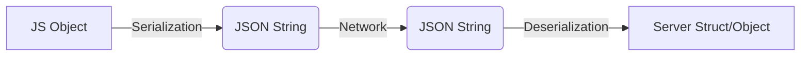

#  Serialization and Deserialization in Backend Systems

---

#  Table of Contents


1.  **Introduction: The Communication Problem**
2.  **The Core Concept: What is Serialization?**
    *   Definition & Intuition
    *   Real-World Analogy: The Ikea Furniture
    *   The "Why": The Language Barrier (JavaScript vs. Rust)
3.  **The Network Stack: Where does this happen?**
    *   The OSI Model High-Level Overview
    *   The Application Layer vs. The Physical Layer
    *   The Backend Engineer's Mental Model
4.  **The Solution: Common Standards**
    *   Format Agreement
    *   Language Agnosticism
5.  **Serialization Formats**
    *   Text-Based Formats (JSON, XML, YAML)
    *   Binary Formats (Protobuf, Avro)
    *   Choosing the Right Tool
6.  **Deep Dive: JSON (JavaScript Object Notation)**
    *   Structure and Syntax Rules
    *   Data Types in JSON
    *   Example: A Complex JSON Object
7.  **The Lifecycle of a Request (Step-by-Step)**
    *   Client-Side Serialization
    *   Transmission
    *   Server-Side Deserialization
    *   The Response Cycle
8.  **Code Examples**
    *   The Client (JavaScript/React)
    *   The Server (Python/Rust Simulation)
9.  **Common Mistakes and Pitfalls**
10. **Troubleshooting and Debugging**
11. **Best Practices**
12. **Quick Reference / Cheat Sheet**
13. **Comparison Tables (JSON vs XML vs YAML vs Protobuf)**
14. **Counter-Examples and Anti-Patterns**
15. **Real-World Scenarios and Case Studies**
16. **Glossary of Terms**
17. **Self-Assessment Questions**

---


# 1️⃣ Introduction: The Communication Problem

In the world of backend engineering, we rarely work in isolation. A system is usually composed of two distinct parts:

1.  **The Client (Frontend):** usually a browser (Chrome, Firefox) running a **JavaScript app** (React, Angular, Vue, Svelte). It is highly interactive and dynamic.
2.  **The Server (Backend):** running on `localhost` or a remote cloud provider (AWS, GCP, Azure). This can be written in **any language**—Rust, Go, Python, Java.

### The Disconnect
The client communicates with the server through a network (HTTP, gRPC, WebSocket). For the purpose of this guide, we focus on **HTTP/REST APIs**.

The client makes a request (GET, POST, etc.) provided with:
*   URL
*   Headers
*   **Request Body** (The data)

**The fundamental problem is this:**  
How does a **JavaScript** application sending a dynamic object communicate with a **Rust** server that expects strict memory structures?

> "How does the server take this data and is able to make sense of it in its own format, in its own data types? Because JavaScript and Rust have completely different data types."

## ✅ What This Problem Means (Educational Intuition)

Think of a JavaScript object as a **live, editable shape** in memory. Rust expects a **fixed blueprint**. Without an agreed shape, the server cannot safely read the data.

**Real-world analogy:**

* JavaScript object = **spoken language** (flexible, casual, changing)
* Rust struct = **legal contract** (strict, formal, precise)

To communicate, both sides need a **translation standard**. That standard is serialization.

---

# 2️⃣ The Core Concept: What is Serialization?

## 📖 Definition
**Serialization** and **Deserialization** are the techniques used to convert data objects present in complex memory structures into a stream of bytes (or a string format) that can be stored or transmitted.

*   **Serialization (Marshaling):** Converting an object *in memory* (RAM) -> A transmit-able format (Text/Bytes).
*   **Deserialization (Unmarshaling):** Converting the transmit-able format -> An object *in memory* (RAM).

## ✅ What It Is (Definition in One Sentence)

Serialization is the process of converting in-memory data into a transportable representation; deserialization is the reverse process.

## ✅ Why It Exists (Purpose)

Because raw memory layouts are **not portable** between machines, languages, or platforms.

## ✅ How It Works (Mechanism)

1. Pick a **format** (JSON, Protobuf).
2. Convert the in-memory structure into that format.
3. Transmit or store the format.
4. Reconstruct the in-memory structure from the format.

## ✅ When to Use It (Use Cases)

* Client ↔ Server communication
* Writing data to disk
* Caching objects in Redis
* Storing in message queues (Kafka, RabbitMQ)

## 🧊 Real-World Analogy: The "Teleportation" Problem
Imagine you want to teleport a house from New York to London. You cannot physically move the house as one solid block because the transport tubes (the internet cables) are too small.

1.  **Serialization (Disassembly):** You write down a blueprint. You break the house down into bricks and label them. You turn the "House" (a complex structure) into a "List of Instructions/Bricks" (a flat format).
2.  **Transmission:** You mail the instruction manual and the list of bricks.
3.  **Deserialization (Reassembly):** The team in London takes the list, reads the instructions, and rebuilds the house using local materials.

> **Note:** The "House" in New York was made of American wood. The "House" in London might be rebuilt using British brick, but the **structure and meaning** are identical. This is exactly how a **JS Object** becomes a **Rust Struct**.

## ✅ Counter-Example (What Serialization is NOT)

Serialization is **not** just sending a file or copying memory.

* **Bad idea:** Sending raw memory bytes from JavaScript and hoping Rust can read them.
* **Why it's wrong:** Each language has a different memory layout, alignment, and encoding strategy.

## 🧠 The "Why": The Language Barrier

From the transcript:
> "JavaScript is a completely Dynamic language... on the other side Rust is very strict when it comes to types and it is a compiled language."

If you send a raw JavaScript memory block to a Rust server, the Rust server will see garbage. It doesn't know how V8 (JS Engine) stores objects in memory.

**We need a "Lingua Franca" (Common Language).**
We need a format that is **Language Agnostic**.

---

# 3️⃣ The Network Stack: Where does this happen?

To understand where serialization fits, we look at the **OSI Model**.

## 🏗️ The OSI Layers (High Level)
You don't need to master IP packets or data frames, but you need a high-level overview.

1.  **Application Layer (Top):** Where your code lives (HTTP, JSON).
2.  ... (Presentation, Session, Transport, Network, Data Link) ...
3.  **Physical Layer (Bottom):** Voltage signals over optical fiber, radio waves (WiFi).

## 🧠 The Backend Engineer's Mental Model

> "As a backend engineer, the mental model you should have is: The client adheres to a standard, and the server understands this standard."

When you serialize data:
1.  **Application Layer:** You convert logic -> JSON.
2.  **The "Black Box":** The system converts JSON -> Data Frames -> IP Packets -> Bits -> Voltage (0s and 1s).
3.  **The Receive:** The server receives 0s and 1s -> IP Packets -> JSON.
4.  **Application Layer:** You receive JSON -> Logic.

**Important:**
> "It does not matter what the intermediary steps convert the data into... the server only gets to read the JSON. You don't have to worry about the intermediary steps."

## ✅ Why This Matters (Intuition)

If you are debugging a backend issue, you only care about:

* What the client sent (serialized data)
* What the server expected (deserialized structure)

You **do not** need to debug TCP segmentation or IP fragmentation unless you are a network engineer.

---

# 4️⃣ The Solution: Common Standards

Since we cannot send raw memory, we agree on a **protocol**.

> "You will come up with some set of rules and you will ask both the clients and the server to agree that this is the standard."

### The Process
1.  **Client:** Transforms logic (JS) -> **Standard** (JSON).
2.  **Network:** Transmits Standard.
3.  **Server:** Transforms Standard -> Logic (Rust).

This ensures the system is **Domain Agnostic** and **Language Agnostic**.

## ✅ Real-World Analogy: Shipping Labels

Imagine international shipping.

* The **label format** (address, ZIP, country) must be standard.
* The **box contents** can be anything.
* The label makes the system interoperable.

Serialization formats are the **shipping labels** of software systems.

---

# 5️⃣ Serialization Formats

There are many ways to serialize data. The transcript categorizes them into two main buckets.

### 📝 1. Text-Based Serialization
Human-readable files. You can open them in Notepad and understand them.

*   **JSON (JavaScript Object Notation):** The industry standard (used ~80% of the time).
*   **XML (Extensible Markup Language):** Older, verbose, tag-based. Used in legacy enterprise systems (SOAP).
*   **YAML:** Used mostly for configuration (Kubernetes, Docker Compose), rarely for API transmission.

### ⚙️ 2. Binary Serialization
Not human-readable. Compressed and efficient. 

*   **Protobuf (Protocol Buffers):** Google's standard. Very fast, very small.
*   **Avro / BSON:** Other binary formats.

> **Comparison:** 
> *   **Text (JSON):** Easy to debug, easy to read, slightly larger file size.
> *   **Binary (Protobuf):** Hard to debug (looks like gibberish), very small file size, extremely fast.

## ✅ When to Use Text vs Binary

* **Text (JSON/XML):**
    * Use when humans will read logs, requests, or payloads.
    * Great for debugging and quick iteration.

* **Binary (Protobuf/Avro):**
    * Use when performance, bandwidth, or speed is critical.
    * Great for internal microservices and high-frequency systems.

---

# 6️⃣ Deep Dive: JSON (JavaScript Object Notation)

> "JSON is one of the most popular serialization and deserialization standards that gets used for client and server communication."

While it stands for **JavaScript Object Notation**, it is **not limited to JavaScript**. It is used by Python, Java, Rust, Go, etc.

## 📜 The Rules of JSON
1.  **Wrapper:** Must start/end with curly braces `{}` or brackets `[]`.
2.  **Keys:** MUST be strings inside **double quotes** `""`.
    *   *Bad:* `{ name: "John" }` (No quotes on key)
    *   *Bad:* `{ 'name': "John" }` (Single quotes)
    *   *Good:* `{ "name": "John" }`
3.  **Values:** Can be:
    *   String (`"hello"`)
    *   Number (`123`, `3.14`)
    *   Boolean (`true`, `false`)
    *   Array (`[1, 2, 3]`)
    *   Object (Nested JSON `{ ... }`)
    *   `null`

## ✅ JSON: Why It Became the Default

* Minimal syntax
* Human-readable
* Works naturally with JavaScript
* Easy to parse in almost every language

## ✅ JSON Counter-Example (Common Misconception)

Some developers think JSON allows comments or trailing commas. It does not.

**Wrong JSON:**

```json
{
    "name": "Alice", // Invalid comment
}
```

## 🧱 Visual Example
Here is the JSON structure discussed in the transcript:

```json
{
  "name": "The Great Gatsby",
  "id": 123,
  "isAvailable": true,
  "tags": ["classic", "literature"],
  "author": {
    "firstName": "F. Scott",
    "lastName": "Fitzgerald"
  }
}
```

### 🔍 Analysis
*   **Human Readable:** You know exactly what this data represents.
*   **Universal:** A Rust server reads `"id": 123` and converts it to `i32` (Integer). A Python server reads it and converts it to `int`.

---

# 7️⃣ The Lifecycle of a Request (Step-by-Step)

Let's trace the journey of data from a React App (Client) to a Rust Server (Backend).

## 1. The Setup
*   **Client:** React App wants to create a new book.
*   **Data in Client Memory:** A JavaScript Object.
    ```javascript
    const book = { title: "Harry Potter", price: 20 };
    ```

## 2. Serialization (Client Side)
The client cannot send the memory address of `book`. It must serialize it to a string.
*   **Action:** `JSON.stringify(book)`
*   **Result:** A string `"{"title":"Harry Potter","price":20}"`.

## 3. Transmission
The HTTP Request travels over the wire.
```http
POST /api/books HTTP/1.1
Content-Type: application/json

{
  "title": "Harry Potter",
  "price": 20
}
```

## 4. Deserialization (Server Side)
The Rust server receives the stream of bytes. It reads the `Content-Type: application/json` header, knowing it needs to parse JSON.
*   **Action:** The server framework parses the string.
*   **Result:** A Rust Struct is created in server memory.
    ```rust
    struct Book {
        title: String,
        price: i32
    }
    // Instance created: Book { title: "Harry Potter", price: 20 }
    ```

## 5. Processing & Response
The server saves to the database (Postgres). It then wants to send back the result (including the new ID).
*   **Action:** Server Serializes the Rust Struct back to JSON.
*   **Result:** `{"id": 1, "status": "success"}`

## ✅ Visual Breakdown (Data Journey)

```
[JavaScript Object]
    |
    | JSON.stringify()
    v
[JSON String]
    |
    | HTTP Transmission
    v
[JSON String]
    |
    | JSON Parse
    v
[Rust Struct / Server Object]
```

---

# 8️⃣ Concrete Code Examples

Here is how this looks in code, demonstrating the "translation" between languages.

## 🟢 The Client (JavaScript/Node.js)

```javascript
// 1. Data in Memory (JavaScript Object)
const requestData = {
    username: "john_doe",
    age: 25,
    isAdmin: false
};

console.log(typeof requestData); // "object"

// 2. SERIALIZATION
// Converting memory object to JSON String
const serializedData = JSON.stringify(requestData);

console.log(typeof serializedData); // "string"
console.log(serializedData); 
// Output: '{"username":"john_doe","age":25,"isAdmin":false}'

// 3. Sending to Server (Hypothetical fetch)
fetch('https://api.example.com/users', {
    method: 'POST',
    headers: {
        'Content-Type': 'application/json' // Telling server: "This is JSON"
    },
    body: serializedData // Sending the string, not the object
});
```

## 🔴 The Server (Python - acting as the "Strict" receiver)

In Python (using Pydantic/FastAPI), we define strict types, similar to the Rust example in the transcript.

```python
from pydantic import BaseModel
import json

# 1. Define the Expected Structure (The "Rust Struct" equivalent)
class User(BaseModel):
    username: str
    age: int
    isAdmin: bool

# 2. Simulate Receiving Data over Network
# This string comes from the wire
incoming_payload = '{"username":"john_doe","age":25,"isAdmin":false}'

# 3. DESERIALIZATION
# Converting String -> Dictionary/Object
raw_dict = json.loads(incoming_payload)

# Validating and converting to Strict Object
user_entity = User(**raw_dict)

print(type(user_entity)) # <class '__main__.User'>
print(user_entity.age)   # 25 (It is now a usable integer in memory)
```

## ✅ Full Example: End-to-End (Client + Server)

```javascript
// client.js
async function createUser() {
    const payload = { username: "dev_1", age: 30, isAdmin: false };

    const response = await fetch("http://localhost:3000/users", {
        method: "POST",
        headers: { "Content-Type": "application/json" },
        body: JSON.stringify(payload)
    });

    const data = await response.json();
    console.log("Response:", data);
}

createUser();
```

```python
# server.py
from flask import Flask, request, jsonify

app = Flask(__name__)

@app.post("/users")
def create_user():
        data = request.get_json()  # Deserialization
        # Pretend we save to DB
        return jsonify({"status": "ok", "received": data}), 201

if __name__ == "__main__":
        app.run(port=3000)
```

---

# 9️⃣ Common Mistakes and Pitfalls

### ❌ 1. Sending Objects instead of Strings
A common beginner mistake in JavaScript `fetch`:
```javascript
// WRONG
body: requestData 
// result: [object Object] sent over wire

// CORRECT
body: JSON.stringify(requestData)
```

### ❌ 2. Trailing Commas in JSON
JSON is stricter than JavaScript.
*   **JS:** `{ "id": 1, }` (Valid)
*   **JSON:** `{ "id": 1, }` (INVALID - Parse Error)

### ❌ 3. Single Quotes
*   **JS:** `{ 'id': 1 }` (Valid)
*   **JSON:** `{ 'id': 1 }` (INVALID - must use double quotes `"`)

### ❌ 4. Comments
JSON does **not** support comments.
```json
{
  "k": "v" // This will cause a parsing error
}
```

### ❌ 5. Date Objects
JSON has no "Date" type. Dates are usually serialized as ISO strings.
*   **JS:** `new Date()`
*   **JSON:** `"2026-01-25T12:00:00Z"`
*   *Pitfall:* The receiver must know to convert this string back into a Date object manually.

### ❌ 6. Mismatched Field Names
If the client sends `firstName` but the server expects `first_name`, deserialization fails.

**Fix:** Use consistent naming or map fields explicitly.

---

# 🔟 Troubleshooting & Debugging

If your API call is failing with "400 Bad Request" or "syntax error", check the serialization.

### 🕵️‍♀️ Tooling: Burp Suite / Network Tab
As shown in the transcript:
1.  Open **Developer Tools** (Network Tab) or **Burp Suite**.
2.  Look at the **Request Payload**.
3.  Ensure it looks like valid JSON (Double quotes, brackets match).

### 🧪 Debugging Steps
1.  **Copy the JSON** from the network log.
2.  **Paste it** into a JSON Validator (e.g., jsonlint.com).
3.  Check if you accidentally included `undefined`. `JSON.stringify` removes keys with `undefined` values, which might break backend validation if that key was required.

## ✅ Common Error Messages (and Meaning)

* **400 Bad Request:** Invalid JSON or missing required fields.
* **Unexpected token in JSON:** The payload is not valid JSON (often from comments or single quotes).
* **Cannot deserialize value of type X:** The server expected a different type (string vs number).

---

# 1️⃣1️⃣ Best Practices

1.  **Snake_case vs CamelCase:**
    *   JS uses `camelCase` (`firstName`).
    *   Python/Rust often use `snake_case` (`first_name`).
    *   *Best Practice:* Agree on a standard (usually camelCase for JSON APIs) and configure your backend serializer to convert automatically.

2.  **Versioning:**
    *   If you change your serialization structure (rename a key), you break the client. Always version your APIs.

3.  **Content-Type Header:**
    *   ALWAYS send `Content-Type: application/json`.
    *   Without this, the server might try to treat the body as plain text or form data and fail to deserialize.

4.  **Schema Validation:**
    *   Always validate deserialized input (Zod, Joi, Pydantic, Marshmallow).

5.  **Backward Compatibility:**
    *   Add fields rather than removing them abruptly.

6.  **Avoid Over-Nesting:**
    *   Deeply nested JSON becomes hard to maintain.

---

# 1️⃣2️⃣ Quick Reference / Cheat Sheet

| Concept | Definition | Direction |
| :--- | :--- | :--- |
| **Serialization** | Object (Memory) → String/Bytes | Output (Sending) |
| **Deserialization** | String/Bytes → Object (Memory) | Input (Receiving) |
| **JSON** | Text-based, Human-readable, Std for REST | N/A |
| **Key Rule** | Keys must be double-quoted strings | `{"key": "value"}` |

### The Flow


---

# 1️⃣3️⃣ Comparison Tables (JSON vs XML vs YAML vs Protobuf)

| Feature | JSON | XML | YAML | Protobuf |
| :--- | :--- | :--- | :--- | :--- |
| Human Readable | ✅ | ✅ | ✅ | ❌ |
| Compact Size | ⚠️ | ❌ | ⚠️ | ✅ |
| Parsing Speed | ✅ | ❌ | ⚠️ | ✅ |
| Schema Required | ❌ | ❌ | ❌ | ✅ |
| Most Common for APIs | ✅ | ⚠️ (legacy) | ⚠️ (config) | ✅ (internal services) |

---

# 1️⃣4️⃣ Counter-Examples and Anti-Patterns

## ❌ Using Query Strings Instead of JSON Body
**Bad:** Sending complex objects as query params:

```
GET /createUser?name=alice&age=25&admin=false
```

**Good:** Send a JSON body in POST.

## ❌ Passing Language-Specific Objects
If you pass a JavaScript `Map` or `Date` without converting it, you will lose data.

**Rule:** Only send standard JSON-safe types.

---

# 1️⃣5️⃣ Real-World Scenarios and Case Studies

## ✅ Scenario 1: Mobile App and Backend
A Flutter app sends JSON to a Node backend. The JSON becomes a Dart object in the client and a JavaScript object in the server. The **format is the bridge**.

## ✅ Scenario 2: Microservices
Service A sends Protobuf to Service B because speed and bandwidth are critical. Protobuf ensures both services agree on the schema.

## ✅ Scenario 3: Logging
Servers often log JSON to make log aggregation tools (ELK, Datadog) parse logs easily.

---

# 1️⃣6️⃣ Glossary of Terms

* **Serialization:** Converting memory objects into a format for storage or transmission.
* **Deserialization:** Converting that format back into memory objects.
* **Marshaling:** Another word for serialization.
* **Schema:** A strict definition of the shape of data.
* **Payload:** The body of a request/response.

---

# 1️⃣7️⃣ Self-Assessment Questions

1. What is the difference between serialization and deserialization?
2. Why do clients and servers need a common data format?
3. Why is JSON considered human-readable?
4. When would you choose Protobuf over JSON?
5. What is a common mistake when sending JSON from JavaScript?

---

---
